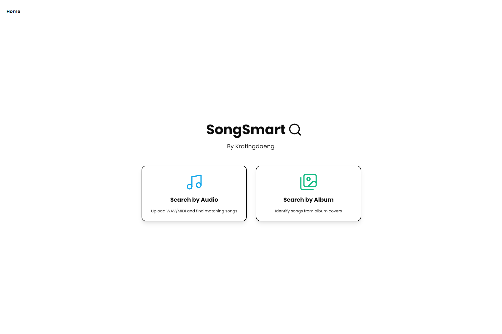

  
</br>

<H3 align="center">Image and Music Information Retrieval : Tugas Besar 2 IF2123 Aljabar Linier dan Geometri </p>

</br>
</br>

##  Kelompok 49 - Kratingdaeng

  

<div align="center">

<table border="1" cellspacing="0" cellpadding="8"> 
  <tr> <th>NIM</th> <th>Nama</th> </tr> 
  <tr> <td>13523035</td> <td>M. Rayhan Farrukh</td> </tr> 
  <tr> <td>13523097</td> <td>Shanice Feodora Tjahjono</td> 
  </tr> <tr> <td>13523148</td> <td>Andrew Tedja Pratama</td> </tr> </table>
</div>

  

##  About

<h3 align="center"> SongSmart 🎵 </h3>
<p align="center"><em>Your Ultimate Solution for Music and Album Cover Searching</em></p>

<div align="center">
  
</div>
</br>
</br>
Ever had a song stuck in your head, that you just can’t figure out the name of? Or stumbled upon a cool album cover that’s too obscure to identify? We’ve all been there—frustrated by the search for a tune or an image that feels just out of reach. **SongSmart** is here to change that.

Welcome to **SongSmart**, your smart solution for **Image Retrieval** and **Music Information Retrieval**. Using cutting-edge **Principal Component Analysis (PCA)** and vector-based matching, SongSmart delivers precise results with speed and accuracy.

<h3><b>Key Features</b></h3>

🎨 **Image Retrieval**: Find visually similar images effortlessly using PCA.  
🎵 **Music Retrieval**: Match hummed melodies to their closest songs with intelligent analysis.  
⚡ **Fast & Accurate**: Experience rapid, precise results powered by advanced vector techniques.

</br>
<h3><b>Discover. Match. Enjoy.</b></h3>
Find the music you can't name and the album covers you can't place.
SongSmart makes finding images and music as intuitive as a hum or a click. 🚀


##  Getting Started
<h3>Installation</h3>
1 . Clone the repo

```sh
git clone git@github.com:grwna/Algeo02-23035.git
```
<p align="center">or</p>

```sh
git clone https://github.com/grwna/Algeo02-23035.git
```
2 . Install NPM packages
```sh
npm install
```
3 . Install Python dependencies
```sh
pip install -r requirements.txt
```
 <h3>Usage</h3> 
1. Run next  

```sh
npm run dev
 
